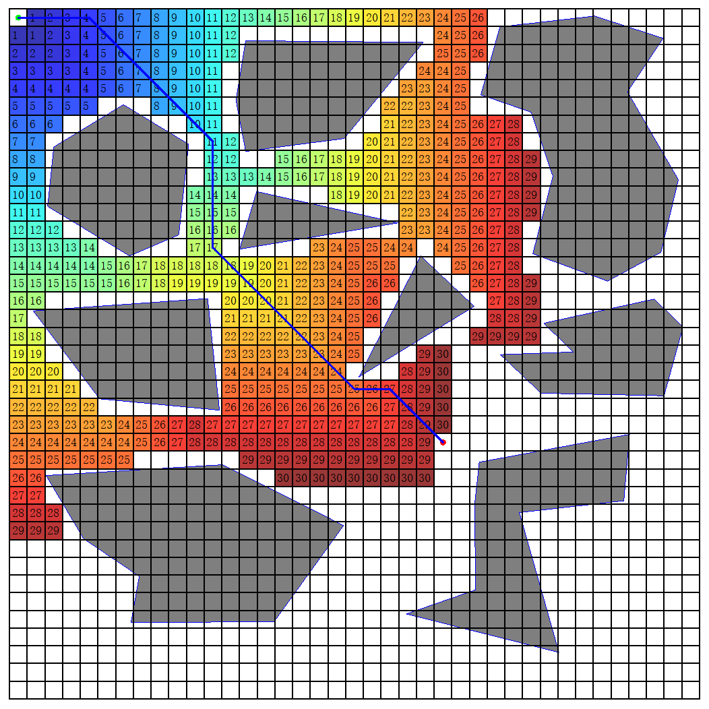
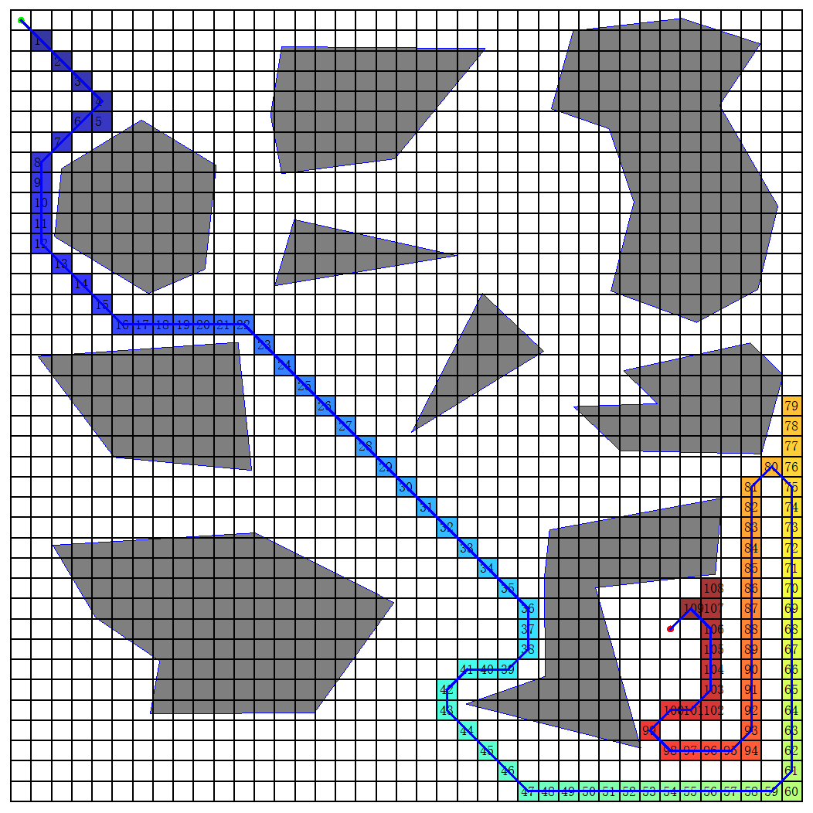
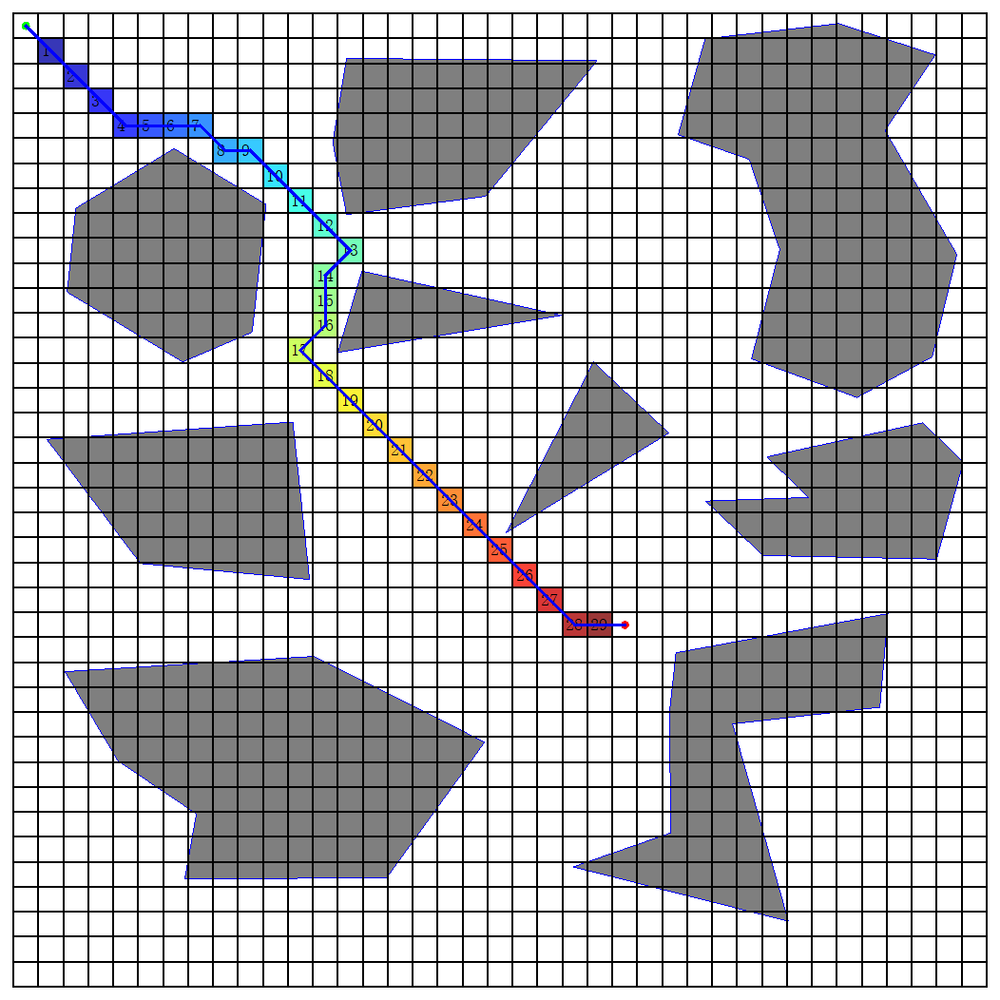
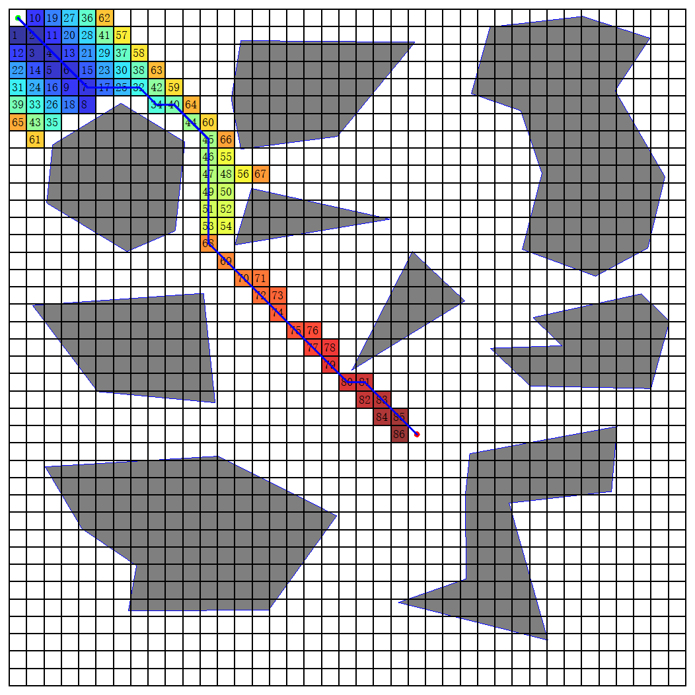
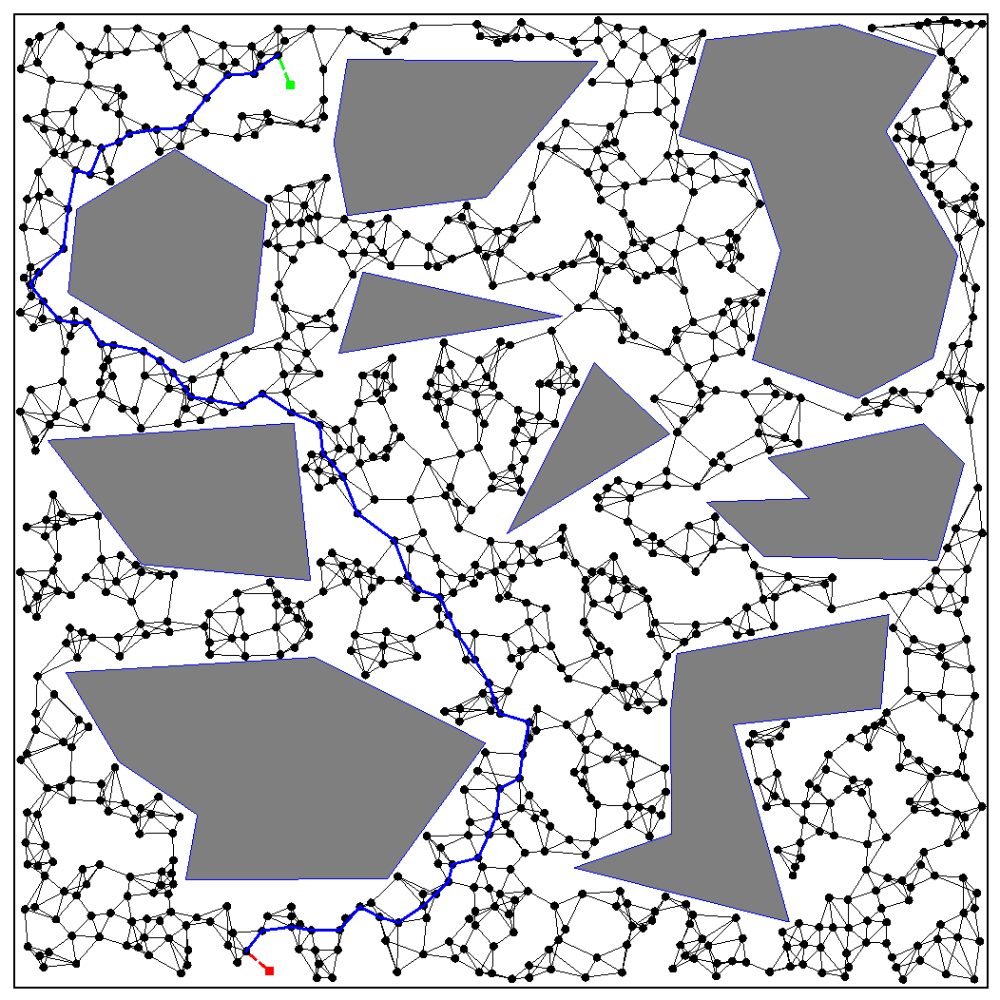
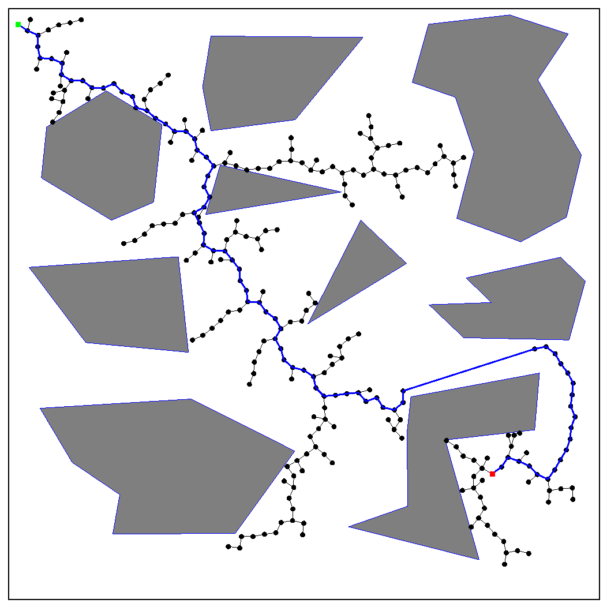

# SimplePlanner
Code used to generate some classical planning algorithm legends for my master's thesis


## Overview

There are two types of planning algorithms in this repo, namely, Graph Search Planning Algorithm (BFS, DFS, Greedy, A*) and Sampling-based Planning Algorithm (PRM, RRT): 

|              Algorithm               |         ScreenShot          |
| :----------------------------------: | :-------------------------: |
|      Breadth First Search (BFS)      |        |
|       Depth First Search (DFS)       |        |
|        Greedy Search (Greedy)        |  |
|                  A*                  |       |
|     Probabilistic Roadmap (PRM)      |        |
| Rapidly-Exploring Random Trees (RRT) |        |


## Usage

### Graph Search Planning Algorithms (BFS, DFS, Greedy, A*)

```shell
python3 app.py --num_horizontal_grid 40 --num_vertical_grid 40 --radius 4 --algorithm [BFS, DFS, Greedy, AStar]
```

* --num_horizontal_grid: the number of horizontal grid
* --num_vertical_grid: the number of vertical grid
* --radius: the radius of the start and goal dots
* --algorithm: the planning algorithm, could be one of BFS, DFS, Greedy and AStar

### Sampling-based Planning Algorithms (PRM, RRT)

```shell
# For PRM
python3 app.py --radius 4 --algorithm PRM --num_node 1000 --num_nearest 4

# For RRT
python3 app.py --radius 4 --algorithm RRT --num_node 1000 --step_size 20
```

* --radius: the radius of the start and goal block
* --algorithm: the planning algorithm, could be one of PRM and RRT
* --num_node: the number of sampled nodes in the Roadmap or Tree
* --num_nearest: the number of nearest neighbours used to construct the roadmap
* --step_size: the step size used to extend the tree


### Setting Start and Goal Position

* Start Position: Mouse Double Left Click (Green)
* Goal Position: Mouse Double Right Click (Red)


Note: You can also edit the `canvas.json` file to customized the environment. 
